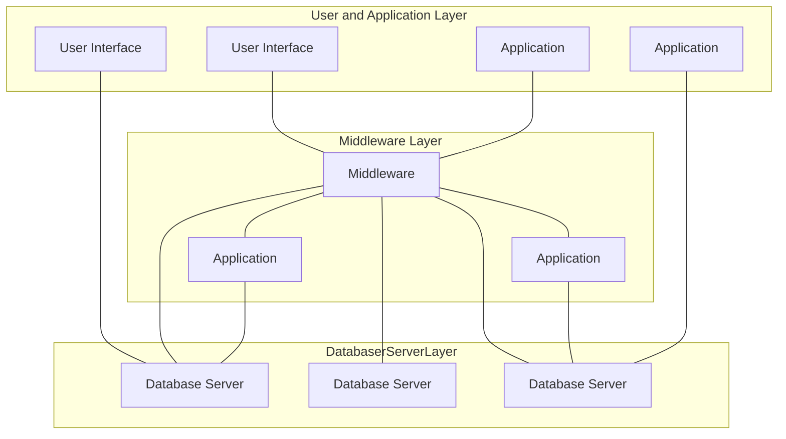
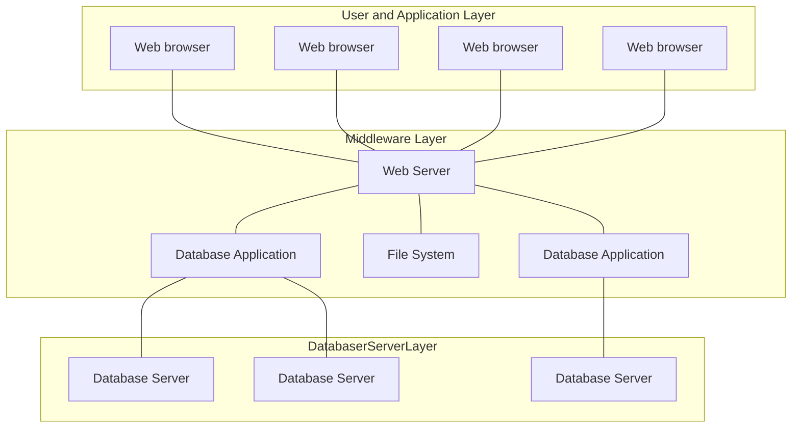
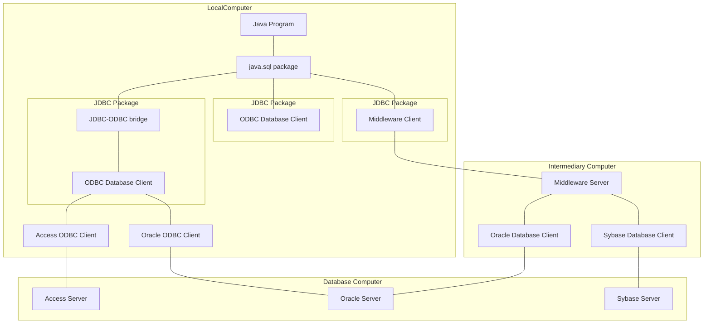

# Database Application Programming

## Agenda:
* Database Application Programming overview
* Introduction to JDBC Technologies
  * JDBC Drivers
  * The seven basic steps of JDBC
  * Retrieving Data from a RESULT SET
  * using prepared and callable statements
  * Handling SQL exceptions
  * Submitting multiple statements as a transaction

## Database Application Architecture
* Client-Server Architectures
  * 2-Tier
    * Client
    * Data-server
  * 3-Tier
    * Tier 1:
      * User interface: responsible for user interaction and data presentation
    * Tier 2: Application-Server/Middleware
      * Middleware: protects the data from direct access by the clients
    * Tier 3: Data-Server
      * DB server: responsible for data storage
* Clear separation of user-interface-control and data presentation from application-logic
* Boundaries between tiers are logical. it is quite easily possible to run all three tiers on the same (physical) machine.

### **3-Tier Architecture**

### Example Model of 3-Tier Architecture

## How to Interact with Databases: ODBC
* ODBC: Open DataBase Connectivity
  * Provides a way for the client programs to access a wide
    range of databases and data sources
* ODBC stack 
  * ODBC Application :Visual Basic, Excel,Access, ... 
  * Driver Manager :ODBC.DLL 
  * ODBC Driver :ODBC drivers vary for various data sources 
  * Database Transport :Database transport 
  * Network Transport :TCP/IP or other communication protocols 
  * Data Source :Oracle, MySQL, ...

## Interaction Set up
* make the data source available to the OBDC
  * install ODBC driver manager
  * install specific driver for data source
  * Register the data source
    driver to the ODBC driver
    manager
* How application works with data source
  * Contacts driver manager to
    request for specific data
    source
  * Manager finds appropriate
    driver for the data source
    7

## How to Interact with Database in JAVA: JDBC
* JDBC is located in the java.sql package

### Usage Strategies
* JDBC-ODBC Bridge
  * Con: ODBC must be
    installed
* JDBC Database Client 
  * Con: JDBC driver for each
    server must be available
* JDBC Middleware client
  * Pro: Only one JDBC client required
  * Application does not need
    direct connection to DB
    (e.g., applet)

