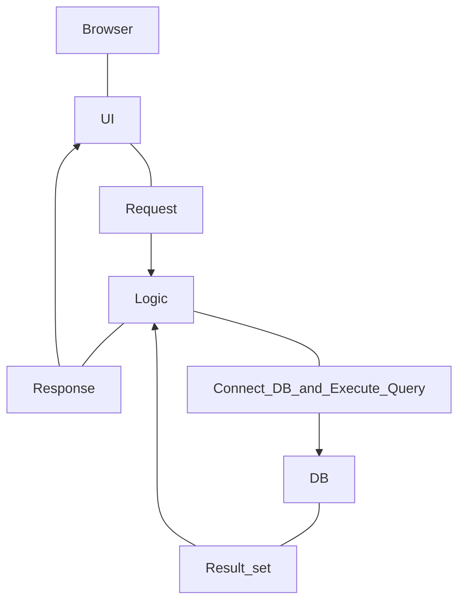
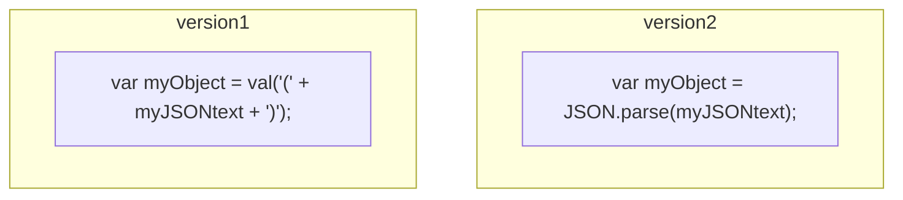
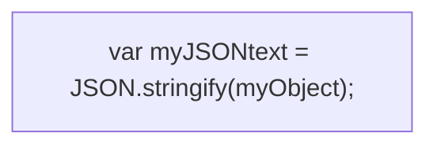

# SQL and the Web
* XML/JSON and Semi-Structured Data



### DataBase No Longer Stands Alone
* Who writes SQL queries at the Oracle promt?

### Why XML (and JSON)?
* XML is the confluence of several factors:
  * The Web needed a more declarative format for data - human and machine readable
  * Documents needed a mechanism for extended tags
  * Database people needed a more flexible interchange format
  * It's parsable even if we don't know what it means!
* Original Expectation:
  * the whole web would go to XML instead of HTML
* Today's Reality:
  * Not so... but XML (and JSON) are used all over "under the covers"

### Why DB people care about XML
* Can get data from all sorts of sources
  * We can touch data that we don't own
  * Documents can be data
  * is a huge change to the DB world
* Unique relationships with DB techniques
  * useful in relationship-style operations
  * Leverages ideas from object-oriented semistructured data
* Blends Schema and Data into one format
  * improvement against the Relationship Models which need schemas
  * a lack of a schema is a drawback

### How about modern websites?
* Modern websites contain many pieces that create what we can see
  * Database and/or key-value-store backend
    * possibly a caching layer
  * Server-side Dynamic Code
  * Client-side Dynamic Code

### A Big (and Frustration) Issue
* When I pass data from the serve to the client, and vice versa, how do I do it?
  * Server-side language and Client-side language (JavaScript) are often NOT THE SAME
  * so we need to **MARSHALL** objects from one side to the other, and convert them
    * **and we need type/class definitions on both sides**
  * Typically data is passed in JSON form - **JavaScript Object Notation** (JSON)

## JSON

* JSON stands for JavaScript Object Notation
  * Despite the name, JSON is a (mostly) language-independent way of
    specifying objects as name-value pairs
* Example of JSON code:
```json
{"skillz":{
  "web":[
    { "name": "html", 
      "years": 5
    },
    { "name":  "css",
      "years": 3
    }],
  "database": [
    { "name":  "sql",
      "years": 7
    }]
}}
```

### JSON Syntax
* an _object_ is an unordered set of name/value pairs
  * pairs are enclosed in braces: {}
  * names and values are separated by colons
  * pairs are separated by commas
  * Example:
```json
    {"name": "html", "years": 5}
```

* an _array_ is an ordered collection of values
  * the values are enclosed in brackets: []
  * values are separated by commas
  * Example:
```json
["html", "css", "xml"]
```

* A _VALUE_ can be a(n):
  * String
  * number
  * true
  * false
  * null
  * object
  * array
  * These values can be nested
* _Strings_ are enclosed in double quotes, and can
  contain the usual assortment of escaped characters
* _Numbers_ have the usual C/C++/Java syntax, including
  exponential (E) notation
  * All numbers are decimal--no octal or hexadecimal
* _Whitespaces_ can be used between any pairs of tokens

### Using JSON in JavaScript

* need a JSON parser or a function, **stringify()**, to convert between JSON encoded data and JavaScript objects
* **JSON encoded data --> JavaScript Object**

* **JavaScript value --> JSON encoded data**


### Using JSON in XmlHttpRequest
* Sending JSON encoded data to the server
  * Use HTTP POST method and send JSON encoded data in the body of the request
```angular2html
xmlhttp.setRequestHeader(
    'Content-type',
    'application/x-www-form-urlencoded;charset=UTF-8;'
);
xmlhttp.send('jsondata=' + escape(myJSONText));
```
* Handling JSON encoded data from the Server
  * server should set the content type to "text/plain"
  * in the handler function of xmlhttp object, read xmlhttp.responseText

### eval
* The JavaScript **eval(_string_)** method compiles and executes the given string
  * the string can be an expression, a statement, or a sequence of statements
  * expressions can include variable and object properties
  * **eval** returns the value of the last expression evaluated
* When applied to JSON, **eval** returns the described object

### Using JSON in Java
```java
import org.json.simple.JSONObject;
import org.json.simple.JSONArray;
......
public class MyServlet extends HttpServlet {
public void
doGet (HttpServletRequest request,HttpServletResponse response)
throws ServletException, IOException
{
response.setContentType("text/html");
PrintWriter out = response.getWriter();
String feedURLString = request.getParameter("feedURL");
String script ="";
JSONObject obj = new JSONObject();
JSONArray arry = new JSONArray();
......
}
```

### Speeding up AJAX with JSON
* Both XML and JSON use structured approaches to mark up data
* More and more web services are supporting JSON
  * e.g.: Yahoo's various search services, travel planners, and
    highway traffic services

**JavaScript code to handle XML encoded data**
```javascript
function myHandler() {
    if (req.readyState == 4 /*complete*/) {
        var addrField = document.getElementById('addr');
        var root = req.responseXML;
        var addrsElem = root.getElementsByTagName('addresses')[0];
        var firstAddr = addrsElem.getElementsByTagName('address')[0];
        var addrText = fistAddr.firstChild;
        var addrValue = addrText.nodeValue;
        addrField.value = addrValue;
    }
}
```
**JavaScript code to handle JSON encoded data**
```javascript
function myHandler() {
    if (req.readyState == 4 /*complete*/) {
        var addrField = document.getElementById('addr');
        var card = eval('(' + req.responseText + ')');
        addrField.value = card.addresses[0].value;
    }
}
```
**Both examples try to update the value of a form element named "addr" with the data obtained from an HTTP request.**

## XML
* Extensive Markup Language
  * designed to describe data
* XML and related technologies (DTD, XML Schema, XPath,
  XQuery, etc.) have been standardized mainly by the World Wide Web Consortium (W3C)